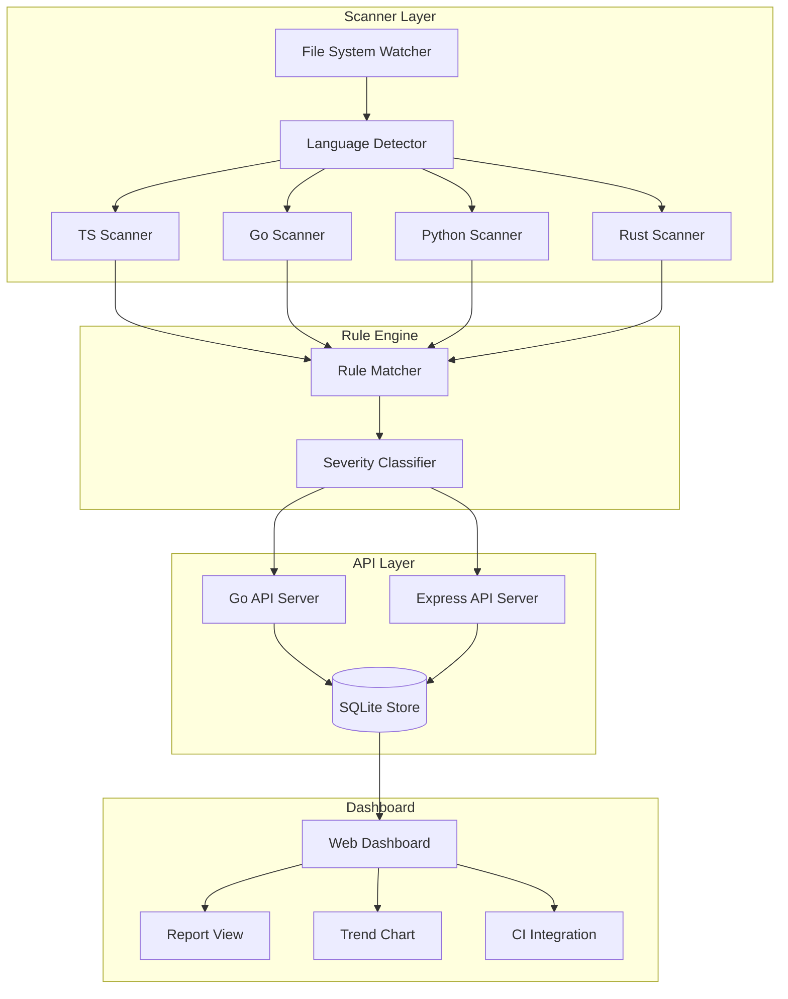

<div align="center">

# 🔬 EvalScope

**Multi-language code evaluation and vulnerability scanning platform** — scan codebases, APIs, and configurations for **security issues**, **style violations**, **performance bottlenecks**, and **compliance gaps**, surfaced through a rich web dashboard.

[](https://github.com/Crynge/EvalScope/actions/workflows/ci.yml)
[](https://typescriptlang.org)
[](https://go.dev)
[](LICENSE)
[](https://github.com/Crynge/EvalScope)
[](https://github.com/Crynge/EvalScope/commits/main)

[Scorecard](#-scorecard) • [Quick Start](#quick-start) • [Architecture](#architecture) • [API](#api) • [Modules](#modules) • [Contributing](#contributing)

---

> **⭐ Ship better code?** Star EvalScope to support open-source code quality tools!

</div>

---

## 📊 Scorecard

```
┌────────────────────────────────────────────────────────────────┐
│                    EVALSCOPE SCAN REPORT                        │
├────────────────────────────────────────────────────────────────┤
│ Repository:   Crynge/eval-demo     Branch: main                │
│ Commit:       a1b2c3d4             Scanned: 2026-07-01         │
├────────────────────────────────────────────────────────────────┤
│ Category          Score     Issues    ──────────── Progress    │
│ Security          ████████░░  80%     12    ▓▓▓▓▓▓▓▓░░░░░░   │
│ Code Style        ███████░░░  70%     24    ▓▓▓▓▓▓▓░░░░░░░░   │
│ Performance       █████████░  90%      3    ▓▓▓▓▓▓▓▓▓░░░░░░   │
│ Accessibility     ██████░░░░  60%     18    ▓▓▓▓▓▓░░░░░░░░░░   │
│ Compliance        ████████░░  80%      7    ▓▓▓▓▓▓▓▓░░░░░░░░   │
│ Test Coverage     █████░░░░░  50%     31    ▓▓▓▓▓░░░░░░░░░░░░  │
├────────────────────────────────────────────────────────────────┤
│ OVERALL           ███████░░░  72%     95 issues                │
│ VERDICT:          ⚠️ Needs improvement (threshold: 80%)        │
└────────────────────────────────────────────────────────────────┘
```

## Features

| Feature | Description | Languages |
|---|---|---|
| **🔒 Security Scan** | **SQL injection**, XSS, hardcoded secrets, credential leaks | TS, Go, Python, Rust |
| **🎨 Style Check** | Linting, formatting, naming conventions | TS, Go, Python |
| **⚡ Performance** | **Bottleneck detection**, memory leak analysis | Go, Rust |
| **♿ Accessibility** | ARIA labels, **contrast ratios**, keyboard nav | HTML, TSX |
| **📋 Compliance** | SPDX headers, **license audits**, dependency checks | All |
| **📈 Test Coverage** | Line/branch coverage mapping | TS, Go, Python |

---

## Quick Start

```bash
# Install
npm install @crynge/evalscope

# Scan a directory (auto-detects language)
npx evalscope scan ./src --format detailed

# CI mode — fail build if score below threshold
npx evalscope scan ./src --ci --threshold 80

# Start web dashboard
npx evalscope dashboard --port 8080
```

```typescript
import { Scanner } from '@crynge/evalscope/scanner';

const scanner = new Scanner({
  categories: ['security', 'performance', 'compliance'],
  failOn: ['critical', 'high'],
});

const report = await scanner.scan('./src');
console.log(report.summary);
// { score: 85, passed: true, issues: { critical: 0, high: 2, medium: 7 } }
```

---

## Architecture



---

## API

```bash
# Run a scan
curl -X POST http://localhost:8080/api/scan \
  -H "Content-Type: application/json" \
  -d '{"path": "./src", "categories": ["security", "performance"]}'

# Get results
curl http://localhost:8080/api/results/latest

# Get trend data
curl http://localhost:8080/api/trends?days=30
```

---

## Modules

```
src/
├── api/
│   ├── server.ts            # TypeScript REST API
│   └── server.go            # Go REST API (high-throughput)
├── scanner/
│   └── scanner.ts           # Scan engine
├── rules/
│   └── rules.ts             # Rule definitions
└── web/
    └── server.ts            # Dashboard frontend
```

---

## Contributing

See [CONTRIBUTING.md](CONTRIBUTING.md) for guidelines.

- [Open an issue](https://github.com/Crynge/EvalScope/issues)

---

## License

[MIT](LICENSE)

---

## 🌐 Crynge Ecosystem

All repos are **free and open-source**. ⭐ Star what you use!

| Category | Repos |
|---|---|
| **LLM & AI** | [SpecInferKit](https://github.com/Crynge/SpecInferKit) · [AetherAgents](https://github.com/Crynge/AetherAgents) · [PromptShield](https://github.com/Crynge/PromptShield) |
| **Marketing** | [AdVerify](https://github.com/Crynge/AdVerify) · [Attributor](https://github.com/Crynge/Attributor) · [InfluencerHub](https://github.com/Crynge/InfluencerHub) · [EdgePersona](https://github.com/Crynge/EdgePersona) · [AdVantage](https://github.com/Crynge/AdVantage) · [BrandMuse](https://github.com/Crynge/BrandMuse) · [CampaignForge](https://github.com/Crynge/CampaignForge) |
| **Simulation** | [CivSim](https://github.com/Crynge/CivSim) · [EvalScope](https://github.com/Crynge/EvalScope) |
| **Operations** | [OpsFlow](https://github.com/Crynge/OpsFlow) |

<div align="center">
  <sub>Built by <a href="https://github.com/Crynge">Crynge</a> · ⭐ Star us on GitHub!</sub>
</div>
