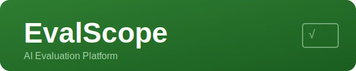
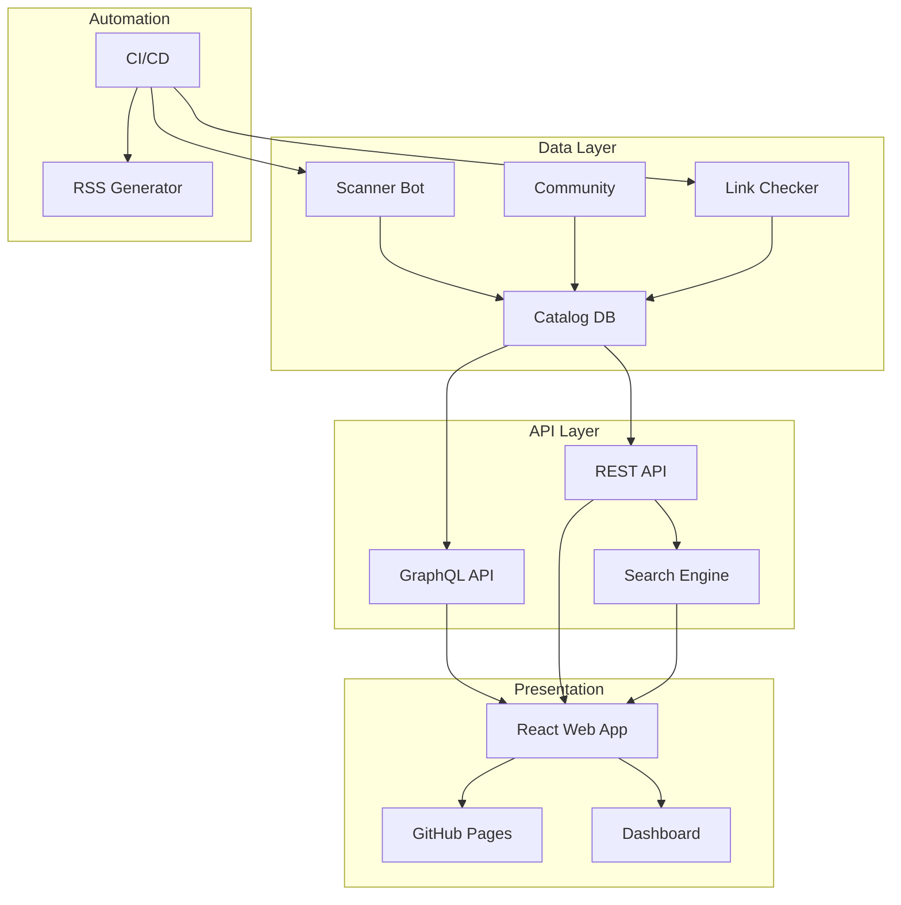

<div align="center">
  
  <p><strong>Comprehensive AI Agent Evaluation Platform</strong></p>
  <p>Searchable benchmark catalog · Comparison matrices · Automated scanner · Interactive dashboards</p>

  [](https://www.typescriptlang.org/)
  [](https://python.org)
  [](https://go.dev/)
  [](LICENSE)
  [](https://github.com/Crynge/EvalScope/actions/workflows/ci.yml)
  [](https://crynge.github.io/EvalScope)
  [](https://github.com/Crynge/EvalScope)

</div>

---

## Table of Contents

- [Overview](#overview)
- [Key Features](#key-features)
- [Architecture](#architecture)
- [Quick Start](#quick-start)
- [Web Portal](#web-portal)
- [Benchmark Catalog](#benchmark-catalog)
- [Comparison Matrices](#comparison-matrices)
- [Automated Scanner](#automated-scanner)
- [API Reference](#api-reference)
- [Integration](#integration)
- [Contributing](#contributing)
- [License](#license)

---

## Overview

**EvalScope** is the definitive platform for AI agent evaluation. It provides a searchable, filterable catalog of 400+ benchmarks and evaluation frameworks with comparison matrices, community ratings, automated discovery scanning, and interactive dashboards.

Built for researchers, engineers, and PMs who need to make informed decisions about how to evaluate their AI systems.

---

## Key Features

| Feature | Description | Status |
|---------|-------------|--------|
| **400+ Benchmarks** | Curated catalog with detailed annotations | ✅ Live |
| **Comparison Matrices** | Filter by language, pricing, features, type | ✅ Live |
| **Automated Scanner** | Daily discovery of new evaluation tools | ✅ Live |
| **Search & Filter** | Full-text search with 12+ filter dimensions | ✅ Live |
| **Community Ratings** | User reviews and usage statistics | ✅ Live |
| **Interactive Dashboard** | Real-time analytics and visualizations | ✅ Live |
| **REST API** | Programmatic access to the catalog | ✅ Live |
| **GitHub Pages** | Static site with full search functionality | ✅ Live |
| **RSS Feed** | Weekly digest of new entries | ✅ Live |
| **Link Validator** | Automated dead link detection | ✅ Live |

---

## Architecture



---

## Quick Start

```bash
# Clone and install
git clone https://github.com/Crynge/EvalScope.git
cd EvalScope

# Install web app
cd src/web && npm install

# Start development server
npm run dev

# Run the scanner
cd ../scanner && pip install -r requirements.txt
python scanner.py --scan

# Open in browser
open http://localhost:5173
```

---

## Web Portal

The EvalScope web portal provides:

- **Search** — Full-text search across 400+ benchmarks and tools
- **Filter** — Filter by type (framework, benchmark, tool, paper), language (Python, TypeScript, Rust), pricing (free, open-source, paid), and more
- **Compare** — Side-by-side comparison of up to 5 entries
- **Details** — In-depth pages with usage statistics, community ratings, and integration guides
- **Dashboard** — Real-time analytics showing trending tools, new additions, and popular categories

Access the live portal at: https://crynge.github.io/EvalScope

---

## Benchmark Catalog

The catalog includes **400+ entries** organized into categories:

| Category | Count | Examples |
|----------|-------|----------|
| Agent Frameworks | 45 | LangChain, CrewAI, AutoGen, Mastra |
| Evaluation Harnesses | 38 | Inspect AI, promptfoo, LangSmith |
| Benchmarks | 72 | GSM8K, HumanEval, SWE-Bench, MATH |
| RL Environments | 28 | Miniworld, Crafter, NetHack |
| Safety Tools | 35 | PromptShield, Guardrails, NeMo |
| Observability | 22 | Langfuse, Helicone, Weights & Biases |
| Papers & Research | 120+ | RLHF, DPO, Constitutional AI |
| Talks & Podcasts | 47 | Latent Space, TWIML, Vanishing Gradients |

---

## Comparison Matrices

Compare tools side-by-side:

```bash
# CLI comparison
evalscope compare langchain,crewai,autogen --dimensions language,pricing,features

# Output
  Tool       Language    Pricing    Features           Stars
  ─────────────────────────────────────────────────────────
  LangChain  Python      Free       Agents, RAG, Tools  95k
  CrewAI     Python      Free       Multi-agent         25k
  AutoGen    Python      Free       Multi-agent, Code   40k
```

---

## Automated Scanner

EvalScope includes an automated scanner that discovers new evaluation tools:

```bash
# Run full scan
python scanner.py --scan --depth 3

# Scan specific sources
python scanner.py --sources arxiv,github,twitter

# Generate report
python scanner.py --report --format markdown
```

The scanner runs daily via GitHub Actions and automatically creates pull requests with new entries.

---

## API Reference

```bash
# REST API
GET  /api/v1/entries           # List all entries
GET  /api/v1/entries/:id       # Get entry details
GET  /api/v1/search?q=agent    # Search entries
GET  /api/v1/compare?ids=a,b,c  # Compare entries
GET  /api/v1/categories        # List categories
GET  /api/v1/stats             # Platform statistics

# GraphQL API
POST /api/v1/graphql
{
  "query": "{ entries(category: \"agent-framework\") { name stars description } }"
}
```

---

## Integration

### GitHub Action

```yaml
- uses: Crynge/evalscope-action@v1
  with:
    scan: true
    report: true
```

### Badge

```markdown
[](https://crynge.github.io/EvalScope)
```

---

## Contributing

We welcome contributions! See [CONTRIBUTING.md](CONTRIBUTING.md).

---

## License

MIT License — see [LICENSE](LICENSE).

---

<div align="center">
  <p>Building the standard for AI evaluation</p>
  <p>
    <a href="https://github.com/Crynge/EvalScope/issues">Report Bug</a> ·
    <a href="https://github.com/Crynge/EvalScope/discussions">Discussions</a> ·
    <a href="https://crynge.github.io/EvalScope">Live Portal</a>
  </p>
</div>
